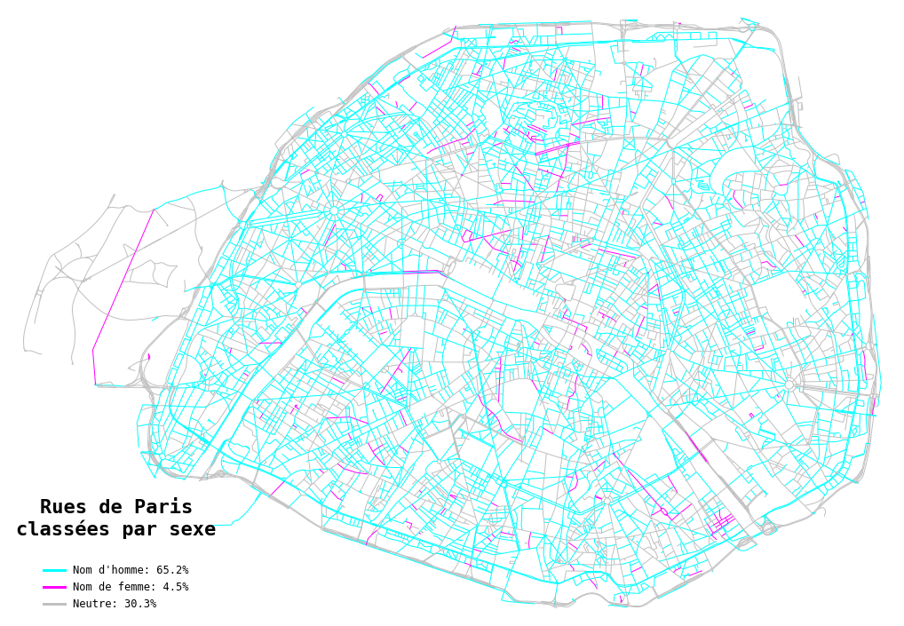
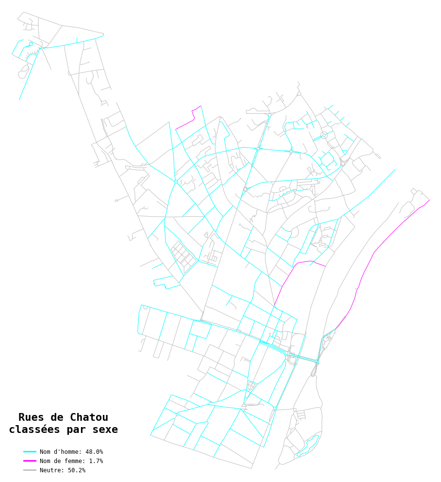
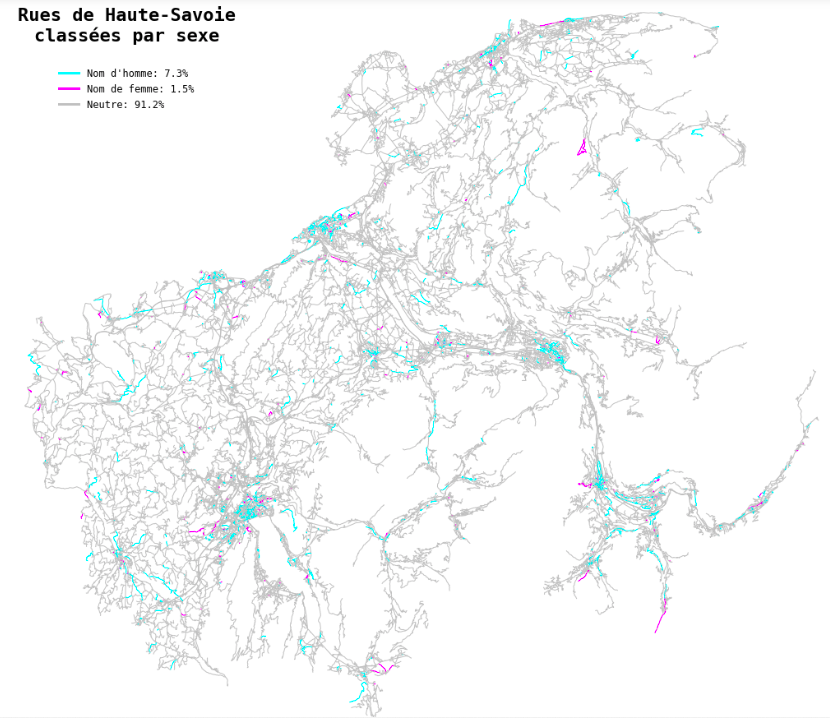

# StreetGender

This repository is the output of a week-end project I did in October 2020. Inspired by [this](https://towardsdatascience.com/what-can-analysing-more-than-2-million-street-names-reveal-c94be585759?gi=dd685ebcf5c5) Medium article, I wanted to analyze street names in France, and especially in the city of Paris, to determine what percentage of them correspond to women vs men (TL;DR: not so much). The challenging part of the work was to accurately classify the roads with famous people's names as either masculine or feminine, and the others as neutral - I detail my method below. I wrapped the code into a Python module with a single class, `StreetGender`, that you can use to classify the streets from any place in France and plot a map coloured by gender - see 'Quick start' and examples below.


## Repo contents

You'll find here:
- a Python module containing an all-in-one class, `StreetGender`
- the `environment.yml` file required to run the code
- examples of output for the city of Paris (static / png format and interactive / html format)

## Quick start

For an easy start, you can analyze any place (for now, only in France...!) by first creating a new environment:

```bash
conda env create -f environment.yml -n street-gender
conda activate street-gender
```

And then run the following Python lines:

```python
your_place = StreetGender('your_place')
your_place.get_genders()
your_place.plot_graph()
```

The place name (str) is passed to `osmnx` to query streets on OpenStreetMap - you can pass a city name, a department or any place name recognized by OSM. Note: just don't choose a whole country or a whole region, computations would be too long.

The `get_genders()` method runs gender classification on all street names and returns a table with road names and corresponding genders (can take a few minutes depending on the number of streets to classify). It can take a `gender` argument (either 'M', 'F' or 'N') to output only the list of either masculine, feminine or neutral streets. 

The `plot_graph()` method draws a coloured map of the streets (static) and can take as optional arguments a list of 3 colors (default: `colors=["silver", "cyan", "fuchsia"]`), the legend localization (default: `legend_loc='lower left'`) and a `save`option (bool) to save your map as a PNG file in the current folder. To plot an interactive `folium` map, use the `plot_folium()` method, which can also take `color` and `save` arguments (the latter saves your map as an interactive HTML file). See examples below (static) and in the `examples` folder (interactive).

Other attributes of the class include: `.road_graph` to access the road `networkx` graph object, `.road_table` for the table of road names, and `.gender_table` for the dictionary used during classification.


## Methodology

Determining the gender of a street names isn't an easy task. It's not about determining the gender of words in the street name - this would classify as masculine or feminine names that are just neutral ('Place des Vosges', etc.). To classify only the names that correspond to people, the most straightforward thing to do is use the gender of first names. But when there is no first name, only the last name, how can we know? 'Rue Cassette' or 'Rue de Berry' could very well correspond to a man, a woman, or even none of them (a place for example). To try and solve this problem, I implemented the classification steps below:

1) Use a list of all French first names + associated gender in order to classify the roads that include a first name. I used the list of all first names between 1900 and 2019 published by INSEE at this [address](https://www.insee.fr/fr/statistiques/2540004?sommaire=4767262#consulter).

2) Do the same with English first names, extracted from the list of all first names given in Scotland since 1910 - available [here](https://www.nrscotland.gov.uk/files//statistics/babies-names/19/babies-first-names-all-names-all-years.csv).

3) To classify some of the roads without a first name, hard-code the gender of a list of words commonly included in street names - especially the military titles, religious titles or titles of nobility (ex: 'Maréchal', 'Général', 'Président', 'Madame', 'Monsieur', 'Duc', 'Duchesse', etc.).

4) To classify the remaining roads named after a famous person but not including their first name or title (ex: 'Rue Monge', 'Rue La Boétie', 'Avenue de Mortemart'), use the `wikipedia` package to search for the current word (ex: 'Monge') on Wikipedia. The code reads the top 3 results, and stops if it finds a first name - in this case, it's highly likely that the road name corresponds to a person, and we can classify their gender. Example: `wikipedia.search('lagrange')` outputs `['Joseph-Louis Lagrange', 'Lagrange multiplier', 'Lagrange (disambiguation)']`, in which 'Joesph' is identified as a man.


Misclassifications can happen for several reasons:

* When the first name isn't recognized - i.e. uncommon names in French and English that I don't have in my list of first names, for example Italian or Deutsch first names.

* When the road name is mistakingly interpreted as a person, because it exists in the list of first names. Example: 'Rue Blanche' where Blanche can be a first name, 'Rue des Iris' or 'Place de Lorraine', which are respectively a color and a flower but can also be first names (note: I removed the first names that much rarer but apparently given to some people since 1900. In most case, once spotted we can remove the misleading first name from the list - if it's not too common and won't be needed to classify real names.

* When the first person that appears on Wikipedia based on the road name isn't the one after which the road was named - for example 'Jenner' outputs 'Kylie Jenner' before 'Edward Jenner' (English physician), and 'Bosquet' outputs 'Céline Bosquet' (TV host) before 'Maréchal Bosquet' (French military officer). A workaround would be to eliminate profiles whose birth date is too recent (as contemporary people often do not give their names to roads), but this would require additional wikipedia scraping.


## Analysis & Next steps

This was a short project, and as seen above classifying the gender of street names can become quite complex, so my method is still far from perfect. However, it clearly confirms that women are (immensely) under-represented in street names... It's true that a majority of historical, politcal or military figures, which often end up on street names, are men - but still, under-representation is blatant. Even with the current efforts to rename streets or name new streets after famous women, we're not there yet...!

The next steps in terms of code would be to:
* decrease computing time - e.g. for now several segments of the same road have the same name but pass through classification several times, maybe this could be avoided 
* decrease the number of classification mistakes (maybe with deeper Wikipedia scraping - but this would increase computing time)
* decrease the number of streets that swim through the mesh of the net and remain unclassified (neutral), while they do correspond to people (e.g. by adding first names from other languages in the gender dictionary)
* adapt the code and method to other languages

In terms of analysis, there are many possibilities:
* compare the major French cities (Paris, Lyon, Marseille, etc.) to see which one has the less sexist street names
* produce a heatmap of French departments, showing which ones have the less sexist street names, to see if there is a geographical difference
* produce more statistics about street names: what's the percentage of religious-based street names, etc.
* use wikipedia scraping to learn more about street names: from which century or historical period does the majority of names come from? Which job / occupation is the most represented? Who are these few women on street names?? - Lots of interesting stuff to discover!


## Examples







